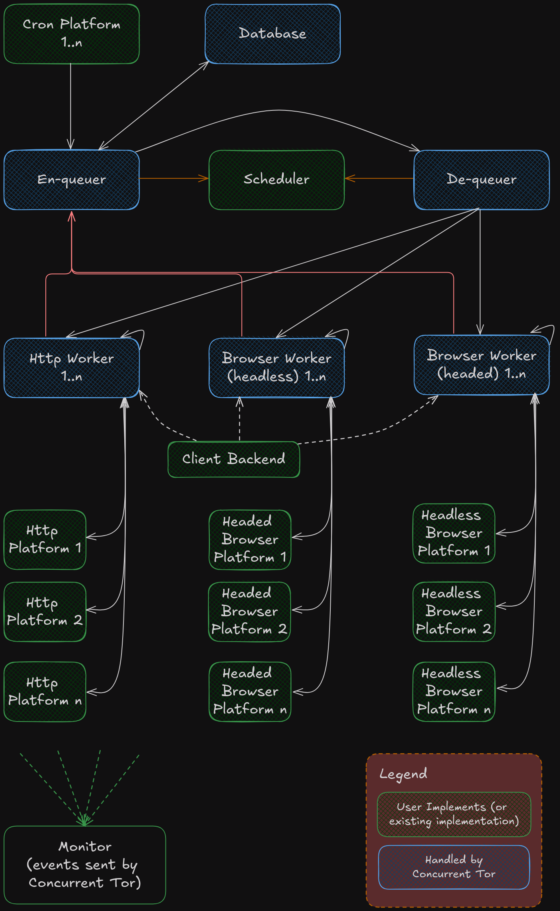

# Concurrent Tor

### A comprehensive scraping runtime.

## Features
- Multiple Tor clients
- Persistent job store across restarts
- Concurrent requests
- Supported request types (all in the same runtime):
  - HTTP
  - Headless browser
  - Headed browser
- Custom job scheduling
- Event monitoring
- Request timeouts
- Client renewals (new IP) on max requests
- Configurable by config file

## [See an Example](examples/basic)

```bash
# Try it out!
git clone https://github.com/Sean-McConnachie/concurrent_tor.git
cd concurrent_tor/examples/basic
cargo run --release --features use_tor_backend
```

## Architecture


## Things to watch out for
- Check the example if you are unsure about how to organise your code.
- Ensure your `hash`ing function for a request type is replicable if you want to prevent duplicate requests.
- Ensure you use the correct flags for all of your request types.
  - In `process_job(...)` you need to use `job.request.as_any().downcast_ref().unwrap();`
  - This will crash if you don't receive the correct request type due to setting the platform wrong somewhere else!
- You must return the job passed by reference in `process_job(...)`.
  - Use `QueueJob::Completed(job.into())` or another variant.
  - The program will rightfully panic if you don't return the job.
- The `target_circulation` will determine how many jobs to pass to the de-queuer.
  - This must be greater than the number of workers.
  - Preferably keep a slight excess so there are some jobs in the queue, and you don't need to wait for a round trip.
- Ensure your `Monitor` implementation receives every event.
  - Ensure you check the `AtomicBool` flagged passed to your monitor on each iteration (see example).
  - Or use the provided `EmptyMonitor` if you don't care about events.
- Do not send jobs for any of the http workers, headed browser workers, or headless browser workers if you do not have
at least one active one. This will cause a panic due to no there being no receiving channels!
- The HTTP backend relies on [hyper](https://crates.io/crates/hyper) and it is relatively low-level.
- If you find any, or want to report bugs, please let me know through a [Github issue](https://github.com/Sean-McConnachie/concurrent_tor/issues) :)

##  [geckodriver](https://github.com/mozilla/geckodriver/releases)

If you want to use the browser, you'll need to provide path to your local [geckodriver](https://github.com/mozilla/geckodriver/releases)

## Tests
There is currently a [single test](tests/architecture.rs).
- It uses the non-tor client (i.e. [reqwest](https://crates.io/crates/reqwest))
- Spawns an [actix web server](https://github.com/actix/actix-web)
- Organises events from:
  - Concurrent Tor backend using a custom monitor
  - The web server
  - The user implementations
- Sorts all events by time
- Ensures the order of execution is correct (since this is essentially a state machine)
- Ensures clients actually get renewed

It's pretty beefy, so good luck if you read through it!

